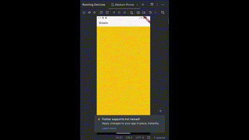

# State Management Stream

## Soal 3

### Penjelasan fungsi keyword yield\*

- fungsi ini menghasilkan stream warna yang berubah setiap detik dengan urutan yang terulang, dan yield\* memungkinkan stream Stream.periodic untuk mengalirkan hasilnya ke dalam stream yang dihasilkan oleh getColors().

## Soal 4

### Caputer Hasil

## Soal 5

### Penjelasan `Listen` dan `Await for`

- `await for` lebih bersifat blocking dalam artian menunggu setiap event secara berurutan, dan lebih cocok untuk situasi di mana Anda perlu menangani setiap event satu per satu secara sinkron.

- `listen` lebih fleksibel dan non-blocking, memungkinkan eksekusi kode lainnya berjalan bersamaan dengan mendengarkan stream.